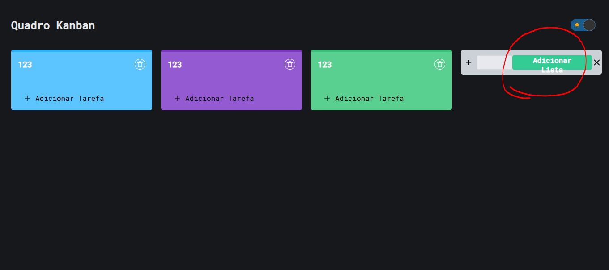
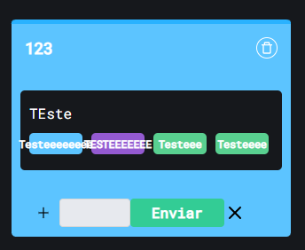
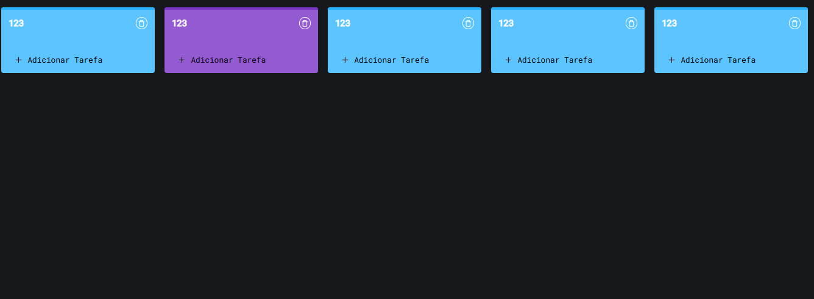
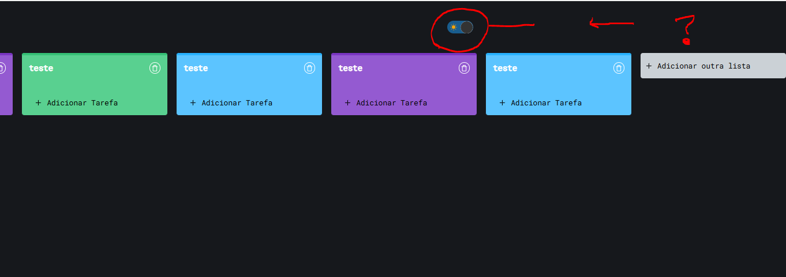
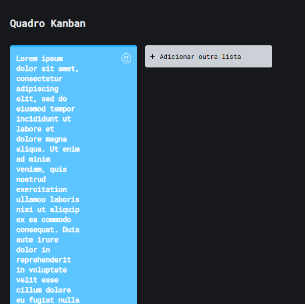
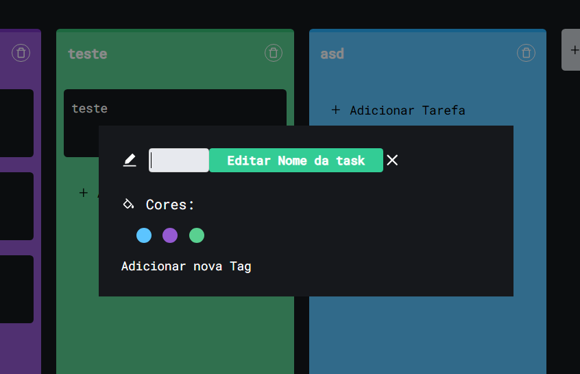
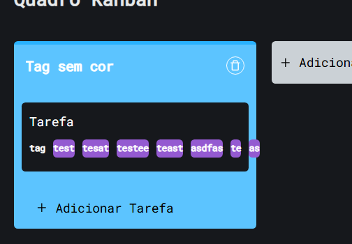
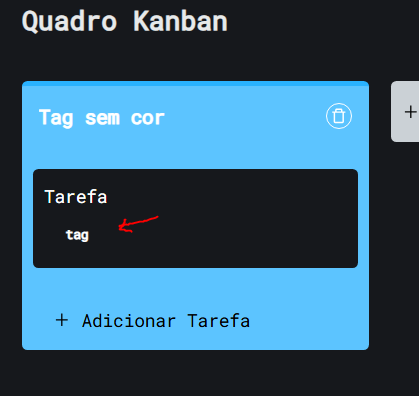

# QA - Kanban

## Inconsistências Visuais

### VIS-001 – Altura da lista
!!! warning "VIS-001 – Altura da lista"
    **Descrição:**  
    Altura da lista é definida pela maior lista no quadro.

    **Passos para Reproduzir:** 
        1. Clique em *Adicionar outra lista* e dê um nome.  
        2. Clique em *Adicionar Lista*.  
        3. Clique em *Adicionar Tarefa* e insira 4 tarefas.  
        4. Crie nova lista.  
        5. Observe altura da lista criada.

    **Comportamento Esperado:**  
    Cada lista deve ter altura conforme seu conteúdo, não herdar de outras.

    **Impacto:** Dificulta leitura, cria espaço desnecessário  
    **Severidade:** 🟡 Média  
    **Evidência:**  
        

---

### VIS-002 – Container sem respiro inferior
!!! warning "VIS-002 – Container sem respiro inferior"
    **Descrição:**  
    Container principal sem padding-bottom.

    **Passos para Reproduzir:** 
        1. Crie uma lista.  
        2. Adicione tarefas até gerar rolagem vertical.  
        3. Role até o final da página.  

    **Comportamento Esperado:**  
    Container deve ter **padding/margin-bottom** adequado.  

    **Impacto:** UX ruim, parece “cortado”  
    **Severidade:** 🟢 Baixa  
    **Evidência:**  
        

---

### VIS-003 – Botão com overflow
!!! warning "VIS-003 – Botão com overflow"
    **Descrição:**  
    Texto do botão “Adicionar Lista” com overflow ao gerar scroll horizontal.

    **Passos para Reproduzir:** 
        1. Crie listas até gerar scroll horizontal.  
        2. Clique no botão *Adicionar outra lista*.
        3. Observe o botão.

    **Comportamento Esperado:**  
    Texto deve ficar contido no botão.  

    **Impacto:** Layout desalinhado, impacta legibilidade  
    **Severidade:** 🟡 Média  
    **Evidência:**  
        

---

### VIS-004 – Tag com overflow
!!! warning "VIS-004 – Tag com overflow"
    **Descrição:**  
    Tag sem truncamento de texto, gerando overflow.

    **Passos para Reproduzir:** 
        1. Crie uma lista.  
        2. Adicione uma tarefa.  
        3. Abra a tarefa criada.  
        4. Clique em uma cor e em → *Adicionar nova Tag*.  
        5. Digite uma tag acima de 8 letras.

    **Comportamento Esperado:**  
    Texto deve ficar contido no botão.  

    **Impacto:** Texto escapa, quebra layout e reduz usabilidade.  
    **Severidade:** 🔴 Alta  
    **Evidência:**  
        

---

### VIS-005 – Ciclo de cores das listas
!!! warning "VIS-005 – Ciclo de cores das listas"
    **Descrição:**  
    Ciclo de cores de listas reinicia incorretamente após a 5ª instância.

    **Passos para Reproduzir:**  
        1. Crie 8 listas.  
        2. Observe cores atribuídas a partir da quinta lista.  

    **Comportamento Esperado:**  
    Ciclo de cores deve seguir padrão definido.  

    **Impacto:** Inconsistência visual, prejudica identificação  
    **Severidade:** 🟢 Baixa  
    **Evidência:**  
        

---

### VIS-006 – Botão Dark Mode não acompanha scroll horizontal
!!! warning "VIS-006 – Botão Dark Mode não acompanha scroll horizontal"
    **Descrição:**  
    Ao criar várias listas e chegar no scroll horizontal, o botão de Dark Mode permanece fixo no local, não acompanhando a lateral da tela.

    **Passos para Reproduzir:** 
        1. Crie múltiplas listas até gerar scroll horizontal.  
        2. Observe o botão de Dark Mode no canto superior.  
        3. Role horizontalmente a tela.  

    **Comportamento Esperado:**  
    O botão de Dark Mode deve se mover junto com o conteúdo lateral ou permanecer fixo de forma que não fique fora da vista do usuário.  

    **Impacto:** Layout inconsistente e confuso, prejudica a usabilidade do controle de tema  
    **Severidade:** 🟡 Média  
    **Evidência:**  
        

---

### VIS-007 – Lista sem truncamento limitando texto
!!! warning "VIS-007 – Lista sem truncamento limitando texto"
    **Descrição:**  
    Ao criar uma nova lista, é possível inserir um texto muito longo que não é truncado, fazendo com que ocupe a tela inteira e quebre o layout.

    **Passos para Reproduzir:** 
        1. Clique em *Adicionar outra lista*.  
        2. Digite um texto muito longo de preferência Lorem Ipsum.  
        3. Adicione a lista e observe como o texto é exibido.  

    **Comportamento Esperado:**  
    O texto da lista deve ser truncado ou quebrado de forma controlada. 

    **Impacto:** Layout quebrado, dificulta visualização e organização das listas  
    **Severidade:** 🔴 Alta  
    **Evidência:**  
        

---

### VIS-008 – Texto inconsistente "task"
!!! warning "VIS-008 – Texto inconsistente 'task'"
    **Descrição:**  
    Ao editar o nome de uma tarefa, aparece o texto *"Editar Nome da task"*.  
    O termo *task* não é utilizado em nenhum outro momento da interface, gerando inconsistência textual.  

    **Passos para Reproduzir:** 
        1. Crie uma nova tarefa em qualquer lista.  
        2. Clique na tarefa para abri-la.  
        3. Clique para alterar o nome da tarefa.  
        4. Observe o texto exibido.  

    **Comportamento Esperado:**  
    O sistema deve manter consistência nos termos utilizados, exibindo *"editar nome da tarefa"* em vez de *task*.  

    **Impacto:**  
    Inconsistência de linguagem, quebra de padrão e confunde usuários menos técnicos.  

    **Severidade:** 🟢 Baixa  
    **Evidência:**  
        

---

### VIS-009 – Texto “adicionar outra lista” incorreto
!!! warning "VIS-009 – Texto 'adicionar outra lista' incorreto"
    **Descrição:**  
    Quando não existe nenhuma lista, o termo *“Adicionar outra lista”* é incorreto.  

    **Passos para Reproduzir:** 
        1. Acesse um quadro sem nenhuma lista criada.  
        2. Observe o botão ou link de criação de lista.  

    **Comportamento Esperado:**  
    O texto deve indicar apenas *“Adicionar lista”* quando não houver nenhuma existente.  

    **Impacto:**  
    Confunde o usuário e quebra consistência textual.  

    **Severidade:** 🟢 Baixa  

---

## Problemas de Usabilidade

### USA-001 – Botão '+' não clicável
!!! warning "USA-001 – Botão '+' não clicável"
    **Descrição:**  
    Ao tentar clicar no '+' em **Adicionar outra lista** ou **Adicionar tarefa**, o cursor muda para a mão, indicando interatividade, mas o clique não funciona.

    **Passos para Reproduzir:** 
        1. Clique no botão *Adicionar outra lista* ou *Adicionar tarefa*.  
        2. Observe que o cursor muda para a mão.  
        3. Tente clicar e verifique que nada acontece.  

    **Comportamento Esperado:**  
    O botão '+' deve ser clicável e executar a ação correspondente (criar lista ou adicionar tarefa).  

    **Impacto:** Usuário não consegue adicionar listas ou tarefas, confunde a expectativa visual  
    **Severidade:** 🟡 Média  

---

### USA-002 – Botão de excluir lista com campo morto
!!! warning "USA-002 – Botão de excluir lista com campo morto"
    **Descrição:**  
    Ao tentar clicar na lixeira para realizar a exclusão da lista, o cursor muda para a mão, indicando interatividade, mas o clique não funciona caso seja nas bordas do botão.

    **Passos para Reproduzir:** 
        1. Clique no botão *Adicionar outra lista* e adicione uma lista.  
        2. Coloque o cursor nas bordas do botão com ícone de lixeira para excluir a lista.  
        3. Tente clicar e verifique que nada acontece.  

    **Comportamento Esperado:**  
    O botão de excluir deve ser clicável e executar a ação correspondente (exclusão da lista).  

    **Impacto:** Usuário não consegue excluir listas, confunde a expectativa visual  
    **Severidade:** 🟡 Média  
    **Evidência:**  
        

---

### USA-003 – "Adicionar nova tag" não aparenta ser botão
!!! warning "USA-003 – 'Adicionar nova Tag' não aparenta ser botão"
    **Descrição:**  
    O texto *"Adicionar nova Tag"* aparece como um simples texto, sem destaque visual ou feedback de interação (sem fundo, sem cursor pointer).  
    Contudo, ao clicar, abre a funcionalidade para criação da tag.  

    **Passos para Reproduzir:** 
        1. Crie uma lista e adicione uma tarefa.  
        2. Abra a tarefa criada.  
        3. Clique em *Adicionar nova Tag*.  
        4. Note que o item parece texto estático, mas abre a criação de tag.  

    **Comportamento Esperado:**  
    O elemento deve ser exibido como botão ou link interativo, deixando claro que pode ser clicado.  

    **Impacto:**  
    Gera confusão e atrapalha a descoberta da funcionalidade.  

    **Severidade:** 🟡 Média  
    **Evidência:**  
        

---

### USA-004 – Possível criar tags infinitamente
!!! warning "USA-004 – Overflow de tags"
    **Descrição:**  
    É possível criar tags infinitamente até que algumas sumam da tela, causando overflow visual.  

    **Passos para Reproduzir:** 
        1. Crie uma tarefa.  
        2. Clique em *Adicionar nova tag* repetidamente até exceder a largura da tela.  

    **Comportamento Esperado:**  
    O sistema deve limitar a quantidade de tags ou permitir scroll horizontal adequado, garantindo que todas fiquem visíveis.  

    **Impacto:**  
    Layout quebrado e dificuldade de visualizar/selecionar tags existentes, prejudicando a usabilidade.  

    **Severidade:** 🟡 Média  
    **Evidência:**  
        

---

### USA-005 – Exclusão sem confirmação
!!! warning "USA-005 – Exclusão sem confirmação"
    **Descrição:**  
    Ao excluir uma tarefa ou lista, o sistema não solicita confirmação do usuário antes de apagar o item.  

    **Passos para Reproduzir:** 
        1. Crie uma lista ou tarefa.  
        2. Clique no botão de excluir (lixeira).  
        3. Observe que o item é removido imediatamente, sem qualquer aviso.  

    **Comportamento Esperado:**  
    O sistema deve exibir uma confirmação antes de excluir, evitando remoções acidentais.  

    **Impacto:**  
    Usuário pode perder dados sem perceber, prejudicando a experiência e confiabilidade do sistema.  

    **Severidade:** 🟡 Média  

---

## Bugs

### BUG-001 – Tag consegue ser criada sem cor
!!! bug "BUG-001 – Tag sem cor"
    **Descrição:**  
    O sistema permite criar uma tag sem selecionar uma cor específica.  

    **Passos para Reproduzir:** 
        1. Crie uma tarefa.  
        2. Clique em *Adicionar nova tag*.  
        3. Não selecione cor e confirme a criação.  

    **Comportamento Esperado:**  
    O sistema deve exigir uma cor antes de criar a tag.  

    **Impacto:**  
    Permite dados inconsistentes e prejudica a organização visual.  

    **Severidade:** 🔴 Alta  
    **Evidência:**  
        

---

### BUG-002 – Dark Mode não persiste
!!! bug "BUG-002 – Dark Mode não persiste"
    **Descrição:**  
    O Dark Mode não mantém a preferência ao recarregar a página.  

    **Passos para Reproduzir:** 
        1. Ative o Dark Mode.  
        2. Recarregue a página.  

    **Comportamento Esperado:**  
    O tema selecionado deve ser mantido entre sessões.  

    **Impacto:**  
    Quebra expectativa do usuário e experiência inconsistente.  

    **Severidade:** 🟡 Média  

---

### BUG-003 – Impossível arrastar tarefa para lista vazia
!!! bug "BUG-003 – Drag and drop em lista vazia"
    **Descrição:**  
    Não é possível arrastar uma tarefa para listas que não possuem nenhuma tarefa.  

    **Passos para Reproduzir:** 
        1. Crie uma lista. 
        2. Adicione uma tarefa nessa lista. 
        3. Crie outra lista. 
        4. Tente arrastar uma tarefa de outra lista para a lista vazia.

    **Comportamento Esperado:**  
    O usuário deve conseguir arrastar tarefas para listas vazias.  

    **Impacto:**  
    Limita funcionalidades do quadro e impede organização de tarefas.  

    **Severidade:** 🔴 Alta

---

