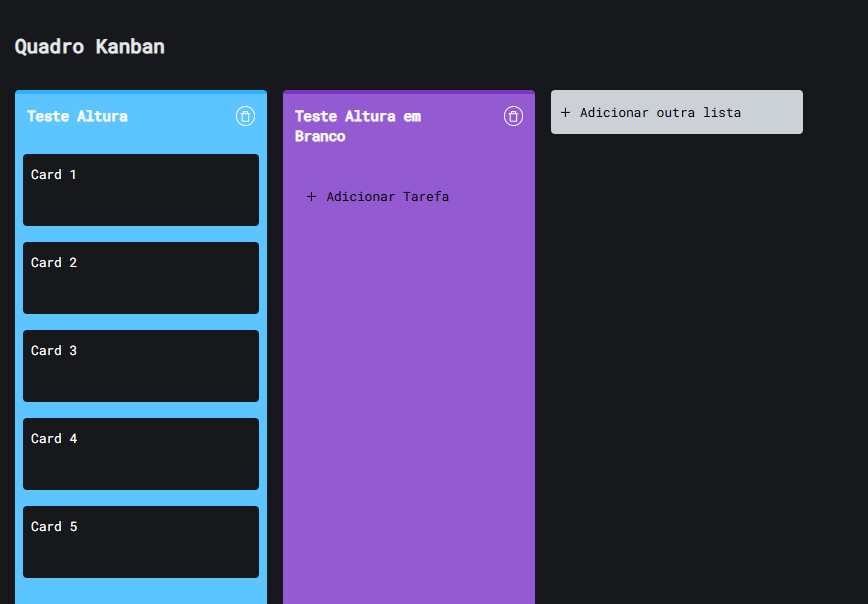

# QA - Kanban

## Inconsistências Visuais

!!! warning "VIS-001 – Altura da lista"
    **Descrição:**  
    Altura da lista é definida pela maior lista no quadro.

    **Passos para Reproduzir:** 
        1. Clique em *Adicionar outra lista* e dê um nome.  
        2. Clique em *Adicionar Lista*.  
        3. Clique em *Adicionar Tarefa* e insira 4 tarefas.  
        4. Crie nova lista.  
        5. Observe altura da lista criada.

    **Comportamento Esperado:**  
    Cada lista deve ter altura conforme seu conteúdo, não herdar de outras.

    **Impacto:** Dificulta leitura, cria espaço desnecessário  
    **Severidade:** 🟡 Média  
    **Evidência:**  
        

---

!!! warning "VIS-002 – Container sem respiro inferior"
    **Descrição:**  
    Container principal sem padding-bottom.

    **Passos para Reproduzir:** 
        1. Crie uma lista.  
        2. Adicione tarefas até gerar rolagem vertical.  
        3. Role até o final da página.  

    **Comportamento Esperado:**  
    Container deve ter **padding/margin-bottom** adequado.  

    **Impacto:** UX ruim, parece “cortado” 
    **Severidade:** 🟢 Baixa  
    **Evidência:**  
        

---

!!! warning "VIS-003 – Botão com overflow"
    **Descrição:**  
    Texto do botão “Adicionar Lista” com overflow ao gerar scroll horizontal.

    **Passos para Reproduzir:** 
        1. Crie listas até gerar scroll horizontal.  
        2. Clique no botão *Adicionar outra lista*.
        3. Observe o botão.

    **Comportamento Esperado:**  
    Texto deve ficar contido no botão.  

    **Impacto:** Layout desalinhado, impacta legibilidade  
    **Severidade:** 🟡 Média  
    **Evidência:**  
        

---

!!! warning "VIS-004 – Tag com overflow"
    **Descrição:**  
    Tag sem truncamento de texto, gerando overflow.

    **Passos para Reproduzir:** 
        1. Crie uma lista.  
        2. Adicione uma tarefa.  
        3. Abra a tarefa criada.  
        4. Clique em uma cor e em → *Adicionar nova Tag*.  
        5. Digite uma tag acima de 8 letras.

    **Comportamento Esperado:**  
    Texto deve ficar contido no botão.  

    **Impacto:** Texto escapa, quebra layout e reduz usabilidade.  
    **Severidade:** 🔴 Alta  
    **Evidência:**  
        

---

!!! warning "VIS-005 – Ciclo de cores das listas"
    **Descrição:**  
    Ciclo de cores de listas reinicia incorretamente após a 5ª instância.

    **Passos para Reproduzir:**  
        1. Crie 8 listas.  
        2. Observe cores atribuídas a partir da quinta lista.  

    **Comportamento Esperado:**  
    Ciclo de cores deve seguir padrão definido.  

    **Impacto:** Inconsistência visual, prejudica identificação  
    **Severidade:** 🟢 Baixa  
    **Evidência:**  
        

---

!!! warning "VIS-006 – Botão Dark Mode não acompanha scroll horizontal"
    **Descrição:**  
    Ao criar várias listas e chegar no scroll horizontal, o botão de Dark Mode permanece fixo no local, não acompanhando a lateral da tela.

    **Passos para Reproduzir:** 
        1. Crie múltiplas listas até gerar scroll horizontal.  
        2. Observe o botão de Dark Mode no canto superior.  
        3. Role horizontalmente a tela.  

    **Comportamento Esperado:**  
    O botão de Dark Mode deve se mover junto com o conteúdo lateral ou permanecer fixo de forma que não fique fora da vista do usuário.  

    **Impacto:** Layout inconsistente e confuso, prejudica a usabilidade do controle de tema  
    **Severidade:** 🟡 Média  
    **Evidência:**  
        

---

!!! warning "VIS-007 – Lista sem truncamento limitando texto"
    **Descrição:**  
    Ao criar uma nova lista, é possível inserir um texto muito longo que não é truncado, fazendo com que ocupe a tela inteira e quebre o layout.

    **Passos para Reproduzir:** 
        1. Clique em *Adicionar outra lista*.  
        2. Digite um texto muito longo de preferência Lorem Ipsum.  
        3. Adicione a lista e observe como o texto é exibido.  

    **Comportamento Esperado:**  
    O texto da lista deve ser truncado ou quebrado de forma controlada. 

    **Impacto:** Layout quebrado, dificulta visualização e organização das listas  
    **Severidade:** 🔴 Alta  
    **Evidência:**  
        

---

!!! warning "VIS-008 – Botão '+' não clicável"
    **Descrição:**  
    Ao tentar clicar no '+' em **Adicionar outra lista** ou **Adicionar tarefa**, o cursor muda para a mão, indicando interatividade, mas o clique não funciona.

    **Passos para Reproduzir:** 
        1. Clique no botão *Adicionar outra lista* ou *Adicionar tarefa*.  
        2. Observe que o cursor muda para a mão.  
        3. Tente clicar e verifique que nada acontece.  

    **Comportamento Esperado:**  
    O botão '+' deve ser clicável e executar a ação correspondente (criar lista ou adicionar tarefa).  

    **Impacto:** Usuário não consegue adicionar listas ou tarefas, confunde a expectativa visual  
    **Severidade:** 🟡 Média  

